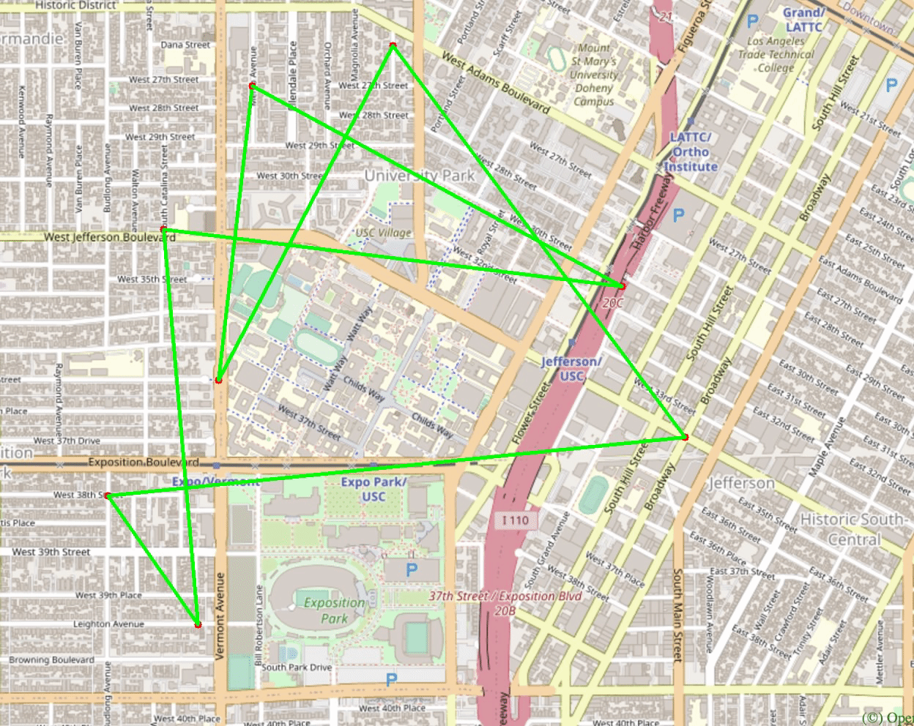

# TrojanMap

This map application can give real-time recommendations of most time and distance optimal route between places near USC.

Author: Shaoen Qin

## Overview

### Functionalities

- Autocomplete the location name
- Find the place's Coordinates in the Map
- Calculate Shortest Path between two places

  - Dijkstra
  - Bellman-ford

- The Traveling Trojan Problem

  - Brute-force
  - Backtracking
  - 2-opt
  - 3-opt

- Cycle Detection

- Topological Sort

- Find K closest points

### Data structure

```cpp
class Node {
  public:
    std::string id;    // A unique id assign to each point
    double lat;        // Latitude
    double lon;        // Longitude
    std::string name;  // Name of the location. E.g. "Bank of America".
    std::vector<std::string>
        neighbors;  // List of the ids of all neighbor points.
};

class TrojanMap {
  public:
    // A map of ids to Nodes.
    std::unordered_map<std::string, Node> data;
    ...
};
```

Data of each node is stored in map.csv (take "Target" for example)

```
id,lat,lon,name,neighbor
5237417650, 34.0257016, -118.2843512, Target, ['6813379479']
```

### Directory Description

`./bazel-*` GoogleTest output files  
`./opencv` OpenCV source files  
`./src` C++ source files  
`./tests` GoogleTest files  
`./opencv.BUILD` OpenCV build file  
`./WORKSPACE` bazel build file

## Detailed description of each function and its time complexity.

### Autocomplete the location name

I consider the names of nodes as the locations. Implement a method to type the partial name of the location and return a list of possible locations with a partial name as a prefix. Please treat uppercase and lower case as the same character.

```c++
std::vector<std::string> Autocomplete(std::string name);
```

- Realization

  1. I traverse all nodes on the map;
  2. If the size of input is greater than the size of node’s name, I will skip this node directly;
  3. Then I compare the input and the beginning part of the node's name;
  4. If they are equal, push the node’s name into result vector.

- Time complexity: O(N), where N is the number of vertices.

- Example

  Input: "ch" \
  Output: ["ChickfilA", "Chipotle Mexican Grill"]

  ```shell
  1
  **************************************************************
  * 1. Autocomplete
  **************************************************************

  Please input a partial location:ch
  *************************Results******************************
  ChickfilA
  Chipotle Mexican Grill
  **************************************************************
  Time taken by function: 2596 microseconds
  ```

- Runtime of this function

| Input | Runtime/microseconds |
| :---: | :------------------: |
| "ra"  |         2173         |
| "ch"  |         2596         |
|  "t"  |         2186         |

### Find the place's Coordinates in the Map

Given a location name, return the latitude and longitude. There are no duplicated location names. You should mark the given locations on the map. If the location does not exist, return (-1, -1).

```c++
std::pair<double, double> GetPosition(std::string name);
```

- Realization

  1. Get the id of input name by GetID() function;
  2. If the name exist, I use GetLat() and GetLon() function of the id; else return (-1, -1);
  3. Once get the longitude and latitude of input name, I can construct a pair and return the result.

- Time complexity: O(N), where N is the number of vertices. Since I use GetID() function, and need to search for a certain key in all key-node pairs, which is the length of N.

- Example

  Input: "Target" \
  Output: (34.0257016, -118.2843512)

  ```shell
  2
  **************************************************************
  * 2. Find the position
  **************************************************************

  Please input a location:Ralphs
  *************************Results******************************
  Latitude: 34.0318 Longitude: -118.291
  **************************************************************
  Time taken by function: 1740 microseconds
  ```

  <p align="center"></p>

- Runtime of this function

|    Input    | Runtime/microseconds |
| :---------: | :------------------: |
|  "Ralphs"   |         1740         |
|    "CVS"    |         1394         |
| "ChickfilA" |         3138         |

### Calculate Shortest Path between two places

Given 2 locations A and B, find the best route from A to B. The distance between 2 points is the euclidean distance using latitude and longitude. You should use both Dijkstra algorithm and Bellman-Ford algorithm. Compare the time for the different methods. Show the routes on the map. If there is no path, please return empty vector.

#### Dijkstra

```c++
std::vector<std::string> CalculateShortestPath_Dijkstra(std::string &location1_name,
                                               std::string &location2_name);
```

- Realization

  1. I create a min-heap using priority queue so that I can get a node with the shortest distance;
  2. I use two map to save the shortest distance of each node and the predecessor of each node separately;
  3. I set each node’s distance as infinite except start node and set start node’s distance as 0;
  4. Then I use a while loop to update the shortest distance map and predecessor map;
  5. Within the while loop, I firstly get a node from the top in the min-heap;
  6. If the node if the end node, stop the while loop;
  7. Otherwise, if this node is unvisited, traverse this node's neighbor nodes to update the shortest distance map and predecessor map and push them in the min heap;
  8. Finally, I use predecessor map to build the entire shortest path.

- Time complexity: O(E + VlogV), where E is the number of edges and V is the number of vertices.

#### Bellman-ford

```c++
std::vector<std::string> CalculateShortestPath_Bellman_Ford(std::string &location1_name,
                                               std::string &location2_name);
```

- Realization

  1. I create a neighbor_map storing the node that needs to be visited, and insert the start node and its neighbors to the map;
  2. I use two map to save the shortest distance of each node and the predecessor of each node separately;
  3. I set each node’s distance as infinite except start node and set start node’s distance as 0;
  4. Then I use a while loop to traverse all nodes in the neighbor_map;
  5. Within the while loop, I traverse all neighbor nodes with current node in the neighbor_map to update the shortest distance map and predecessor map;
  6. If neighbor node’s new distance is greater than the previous one, I insert this neighbor node to neighbor_map;
  7. I would erase a node after visiting it to avoid visiting this node again;
  8. When there is no node's distance need to update, I stop the while loop;
  9. Finally, I use predecessor map to build the entire shortest path.

- Time complexity: O(E\*V), where E is the number of edges and V is the number of vertices.

#### Example

- Input: "Ralphs", "ChickfilA" \
  Output: ["2578244375", "5559640911", "6787470571", "6808093910", "6808093913", "6808093919", "6816831441", "6813405269", "6816193784", "6389467806", "6816193783", "123178876", "2613117895", "122719259", "2613117861", "6817230316", "3642819026", "6817230310", "7811699597", "5565967545", "123318572", "6813405206", "6813379482", "544672028", "21306059", "6813379476", "6818390140", "63068610", "6818390143", "7434941012", "4015423966", "5690152766", "6813379440", "6813379466", "21306060", "6813379469", "6813379427", "123005255", "6807200376", "6807200380", "6813379451", "6813379463", "123327639", "6813379460", "4141790922", "4015423963", "1286136447", "1286136422", "4015423962", "6813379494", "63068643", "6813379496", "123241977", "4015372479", "4015372477", "1732243576", "6813379548", "4015372476", "4015372474", "4015372468", "4015372463", "6819179749", "1732243544", "6813405275", "348121996", "348121864", "6813405280", "1472141024", "6813411590", "216155217", "6813411589", "1837212103", "1837212101", "6820935911", "4547476733"]

  ```shell
  3
  **************************************************************
  * 3. CalculateShortestPath
  **************************************************************

  Please input the start location:Ralphs
  Please input the destination:ChickfilA
  *************************Results******************************
  The distance of the path is:1.53852 miles
  **************************************************************
  Time taken by function: 24238 microseconds
  ```

  <p align="center"></p>

#### Runtime comparison

|                   inputs                   | Dijkstra/ms | Bellman-Ford/ms |
| :----------------------------------------: | :---------: | :-------------: |
|           "Ralphs", "ChickfilA"            |    24238    |     157535      |
|             "Target", "Ralphs"             |    18701    |     194169      |
|          "USC Parking", "Ralphs"           |    29335    |     177033      |
|             "Driveway", "Cava"             |    36764    |     163247      |
|     "Community of Christ", "Birnkrant"     |    40038    |     158370      |
|         "7Eleven", "Coffee Bean1"          |    40513    |     175437      |
| "Vermont Elementary School", "USC Parking" |    17194    |     183557      |
|       "University Park", "Traveler"        |    37821    |     201524      |
|   "Troy View Swimming Pool", "The Pearl"   |    4912     |     184526      |
|      "vietnameseasian", "Wahlburgers"      |    4967     |     184526      |

- Here I can see when the input is same, runtime of Bellman-Ford is longer than runtime of Dijkstra, which is consistent with their time complexity.

### The Traveling Trojan Problem

In this section, I assume that a complete graph is given to you. That means each node is a neighbor of all other nodes.
Given a vector of location ids, assume every location can reach all other locations in the vector (i.e. assume that the vector of location ids is a complete graph). Find the shortest route that covers all the locations exactly once and goes back to the start point. You will need to return the progress to get the shortest route which will then be converted to animation.

#### Brute-force

```c++
std::pair<double, std::vector<std::vector<std::string>>>TrojanMap::TravellingTrojan_Brute_force(std::vector<std::string> &location_ids)
```

- Realization

  1. Set min_cost as infinite;
  2. Do permutations of the input location_ids vector. Calculate the path length of each permutation. If current path length is less than minimum one. Update min and push the current path with the start node in result;
  3. After permutations, the path distance with the last index in the result vector is the shortest path distance;
  4. Return the resulting pair, including the shortest path distance and result vector.

- Time complexity: O(N!), where N is the number of vertices. Since I need to calculate the path length of all possible permutations of location_ids.

- Example

  <p align="center"></p>

<p align="center"></p>

#### Backtracking

```c++
std::pair<double, std::vector<std::vector<std::string>>> TravellingTrojan(
      std::vector<std::string> &location_ids);
```

- Realization

  1. Set min_cost as infinite;
  2. Do permutations of the input location_ids vector. If the current path length is less than the minimum one. Update min and push the current path with the start node in the result.
  3. After permutations, the path distance with the last index in the result vector is the shortest path distance.
  4. Return the resulting pair, including the shortest path distance and result vector.

- Time complexity: O(N!), where N is the number of vertices. Since I need to calculate the path length of all possible permutations of location_ids.

- Example

  <p align="center"></p>

<p align="center"></p>

#### 2-opt

```c++
std::pair<double, std::vector<std::vector<std::string>>> TravellingTrojan_2opt(
      std::vector<std::string> &location_ids);
```

- Realization

  1. Calculate the cost of the input location_ids
  2. Swap each node in the given location_ids, except the starting point
  3. Every time I switch two points, I calculate the cost of the new route and push back the new route in the 2D vector. If the cost of the new route is smaller than the minimum cost, I update the minimum cost and the existing route. Then I can use a do-while loop to go back to step1 do the same operations if the minimum cost was updated.
  4. When the minimum cost does not change, I get the final result.

- Time complexity: O(N ^2), where N is the number of vertices. Since I use two for loops in the code to select the elements needed to be swapped, and each for loop need to execute N times.

- Example

  <p align="center"></p>

  <p align="center"></p>

#### Runtime and accuracy comparison

| Number of Places | Brute-Force/ms | Backtracking/ms | 2-opt/ms |
| :--------------: | :------------: | :-------------: | :------: |
|        2         |       43       |       20        |    30    |
|        3         |       47       |       30        |    46    |
|        5         |      294       |       291       |    95    |
|        7         |      9718      |      7037       |   587    |
|        10        |    3801222     |     3670018     |   1987   |

I can see from the above result that while the number of the places is bigger than 5, the run time of 2-opt is much lower than brute force permutations.

| Number of Places | Shortest Path Length/miles | 2-opt/miles | Difference between 2-opt and Shortest Path Length |
| :--------------: | :------------------------: | :---------: | :-----------------------------------------------: |
|        2         |          1.04781           |   1.04781   |                         0                         |
|        3         |          3.22549           |   3.22549   |                         0                         |
|        5         |          3.59893           |   3.59893   |                         0                         |
|        7         |           4.5426           |   5.03663   |                      0.49403                      |
|        10        |          5.24228           |   5.73519   |                      0.49291                      |

From the above table, I can know that although 2-opt is a faster algorithm compared with backtracking, it may not return the actual shortest path length as a result.

#### 3-opt

```c++
std::pair<double, std::vector<std::vector<std::string>>> TrojanMap::TravellingTrojan_3opt(
      std::vector<std::string> &location_ids)
```

- Realization

  1. Calculate the cost of the input location_ids
  2. Select three points that needed to be swapped and parse them into threeOptSwap() method.
  3. threeOptSwap() method is based on towOptSwap() method. For example, I can get the result of threeOptSwap by swapping the element of index i and index j, then swapping the element of index j and k.
  4. Every time I switch three points, I get a new route and push it back into a 2D vector.
  5. I calculate the cost of each new route in the 2D vector in step 4. vector. If the cost of new route is smaller than the minimum cost, I update the minimum cost and the existing route. Then I can use a do-while loop to go back to step2 do the same operations if the minimum cost was updated.
  6. When the minimum cost does not change, I get the final result.

- Time complexity: O(N ^3), where N is the number of vertices. Since I use three for loops in the code to selecte the elements needed to be swapped, and each for loop need to execute N times. As a result, the time complexity of this function should be O(N^3).

- Example

  <p align="center"></p>

<p align="center"></p>

- Runtime and accuracy comparison

| Number of Places | 3-opt Runtime/ms |
| :--------------: | :--------------: |
|        3         |        31        |
|        5         |       1181       |
|        7         |       2995       |
|        9         |      21165       |
|        10        |      29322       |

| Number of Places | Shortest Path Length/miles | 3-opt/miles | Difference between 3-opt and Shortest Path Length |
| :--------------: | :------------------------: | :---------: | :-----------------------------------------------: |
|        3         |          3.22549           |   3.22549   |                         0                         |
|        5         |          3.59893           |   3.59893   |                         0                         |
|        7         |           4.5426           |   4.5426    |                         0                         |
|        10        |          5.24228           |   5.24228   |                         0                         |
|        11        |          5.67518           |   7.15387   |                      1.47869                      |

From the above table, I can know that although 3-opt is a faster algorithm compared with backtracking, it may not return the actual shortest path length as a result.

### Cycle Detection

In this section, I use a square-shaped subgraph of the original graph by using four coordinates stored in `std::vector<double> square`, which follows the order of left, right, upper, and lower bounds. Then try to determine if there is a cycle path in the that subgraph. If it does, return true and report that path on the map. Otherwise return false.

```c++
bool CycleDetection(std::vector<double> &square);
```

- Realization

  1. Create a map visited, and another map predecessor;
  2. I first traverse all nodes on the map to find the node within the square, and then store them in a visited_map;
  3. I ceate a predecessor map to save the predecessor of each node;
  4. I traverse all nodes in the visited map;
  5. If the node has not been visited, run hasCycle function(DFS) to check is there a cycle;
  6. Within the hasCycle function, I first mark current node as true in visited_map;
  7. Then I traverse current node’s neighbor nodes;
  8. If the neighbor is in the square and it is unvisited, record current node as predecessor node of
  9. neighbor node and do recursive function;
  10. If the final recursive one returns true, this means there is a cycle in the graph. I should return true;
  11. If the neighbor is in the square and it is visited and it’s not the parent node, I should return true;
  12. Otherwise, no cycle is found. I return false;
  13. Finally, if there is a cycle, I use predecessor map to build the cycle path and use PlotPointsandEdges function to show the cycle.

- Time complexity: O(V + E), where E is the number of edges and V is the number of vertices.

- Examples

  ```shell
  5
  **************************************************************
  * 5. Cycle Detection
  **************************************************************

  Please input the left bound longitude(between -118.299 and -118.264):-118.299
  Please input the right bound longitude(between -118.299 and -118.264):-118.264
  Please input the upper bound latitude(between 34.011 and 34.032):34.032
  Please input the lower bound latitude(between 34.011 and 34.032):34.011
  *************************Results******************************
  there exists cycle in the subgraph
  **************************************************************
  Time taken by function: 273734 microseconds
  ```

<p align="center"></p>

- Runtime of this function

|                      Input                       | Runtime/microseconds |
| :----------------------------------------------: | :------------------: |
| {-118.288818, -118.282123, 34.023054, 34.018356} |         681          |
|       {-118.280, -118.264, 34.020, 34.011}       |        60585         |
|       {-118.270, -118.264, 34.016, 34.011}       |        276930        |

### Topological Sort

Tommy Trojan got a part-time job from TrojanEats, for which he needs to pick up and deliver food from local restaurants to various location near the campus. Tommy needs to visit a few different location near the campus with certain order, since there are some constraints. For example, he must first get the food from the restaurant before arriving at the delivery point. The TrojanEats app will have some instructions about these constraints. So, Tommy asks you to help him figure out the feasible route!

```c++
std::vector<std::string> DeliveringTrojan(std::vector<std::string> &location_names,
                                            std::vector<std::vector<std::string>> &dependencies);
```

- Realization

  1. Build the DAG according to the dependencies 2D vector, and build the in degree vector for each position of locations vector;
  2. Push all positions with indegree equals to 0 into a queue;
  3. While the queue is not empty, I record the size of queue. I get the front element of the queue and pop it;
  4. Push back the front element of the queue into the topological sort result vector. Traversing all neighbors of the current element. Decreasing the indegree of all neighbors. If the in-degree of a certain position is equal to zero, push the neighbors into the queue. Repeating the step 3-4 if the queue is not empty;
  5. If the queue is already empty, just return the topological sort result vector.

- Time complexity: O(V+E), where E is the number of edges and V is the number of vertices. I pop each node exactly once from the zero in-degree queue, and that gives us V. Also, for each vertex, I iterate over its adjacency list and in totality, I iterate over all the edges in the graph, which gives us E. Hence, O(E+V)

- Examples

  For example,

  ```shell
  Input:
  location_names = {"Cardinal Gardens", "Coffee Bean1", "CVS","Aldewaniah","Birnkrant","Ralphs","Amazon Pick up Center","Target","Bank of America","Cava"}
  dependencies = {{"Cardinal Gardens","Coffee Bean1"}, {"Cardinal Gardens","CVS"}, {"Coffee Bean1","CVS"},{"CVS","Aldewaniah"},{"Birnkrant","Ralphs"},{"Birnkrant","Cardinal Gardens"},{"Ralphs","Amazon Pick up Center"},{"Ralphs","Target"},{"Target","Cava"},{"Bank of America","Cava"}}
  Output: Cardinal Gardens -> Coffee Bean1 -> CVS
  ```

  ```shell
  6
  **************************************************************
  * 6. Topological Sort
  **************************************************************

  Please input the locations filename:/Users/songchanjuan/Desktop/USC-Courses/EE-538/project/final-project-Chanjuan/input/topologicalsort_locations.csv
  Please input the dependencies filename:/Users/songchanjuan/Desktop/USC-Courses/EE-538/project/final-project-Chanjuan/input/topologicalsort_dependencies.csv
  *************************Results******************************
  Topological Sorting Results:
  Bank of America
  Birnkrant
  Ralphs
  Cardinal Gardens
  Amazon Pick up Center
  Target
  Coffee Bean1
  Cava
  CVS
  Aldewaniah
  **************************************************************
  Time taken by function: 118 microseconds
  ```

  <p align="center"></p>

- Runtime of this function

  | the number of the places | Runtime/microseconds |
  | :----------------------: | :------------------: |
  |            3             |          54          |
  |            6             |          95          |
  |            10            |         191          |

### Find K closest points

Given a location name and a integer k , find the k closest locations with name on the map and return a vector of string ids.

```c++
std::vector<std::string> FindKClosestPoints(std::string name, int k);
```

- Realization

  1. Construct a class called Point, which includes the name of other places and the corresponding distance to input std::string name. Because I can use a max heap of size K to contain K closest points. The order of the maximum heap is a descending order according to the distance member of each Point;
  2. Traversing all nodes in data map and calculating the distance of each node to input name. Using a new Point to store the data of distance and the name for node;

  3. Once I construct a new node, I can push it into the maximum heap;
  4. If the size of the maximum heap is bigger than K, I pop the top of the heap. Loop through step 2-4 until all nodes in the data map are carried out;
  5. While the maximum heap is not empty, I get the top element of it and add it into the front of the result vector.

- Time complexity: O(N\*log k), N is the number of vertices, and k is one of the input variables. I need to calculate the distance from each node to the input std::string name. This is a O(N) time complexity step. When I get each distance, I need to push it into the heap. This will cause O(log k) time.

- Examples

  ```shell
  7
  **************************************************************
  * 7. Find K Closest Points
  **************************************************************

  Please input the locations:ChickfilA
  Please input k:6
  269633667
  6206425701
  4577908517
  4162647227
  4547476734
  732641023
  *************************Results******************************
  Find K Closest Points Results:
  1 Chipotle Mexican Grill
  2 Coffee Bean1
  3 Starbucks
  4 Which Wich
  5 37th StreetUSC
  6 Martin Luther King Jr Blvd  Coliseum
  **************************************************************
  Time taken by function: 506363 microseconds
  ```

<p align="center"></p>

- Runtime of this function

|  K  | Runtime/microseconds |
| :-: | :------------------: |
|  3  |        512554        |
|  5  |        506363        |
| 10  |        512685        |
